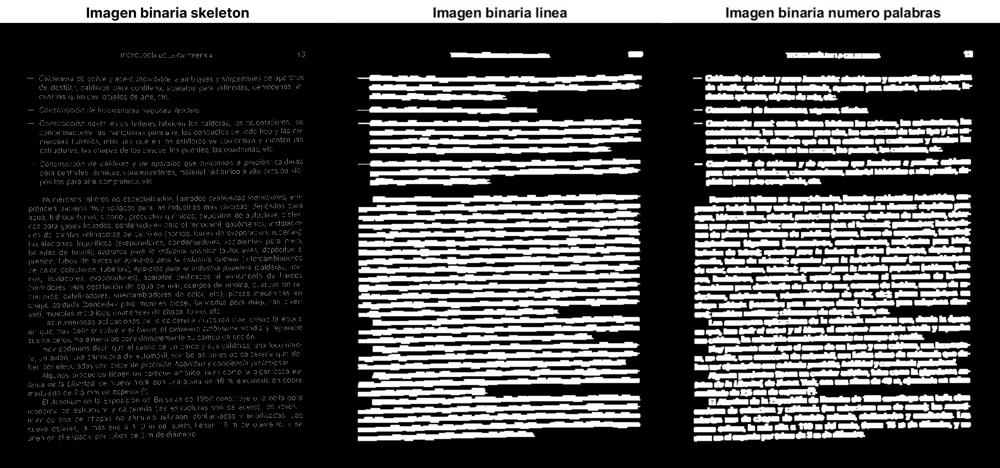
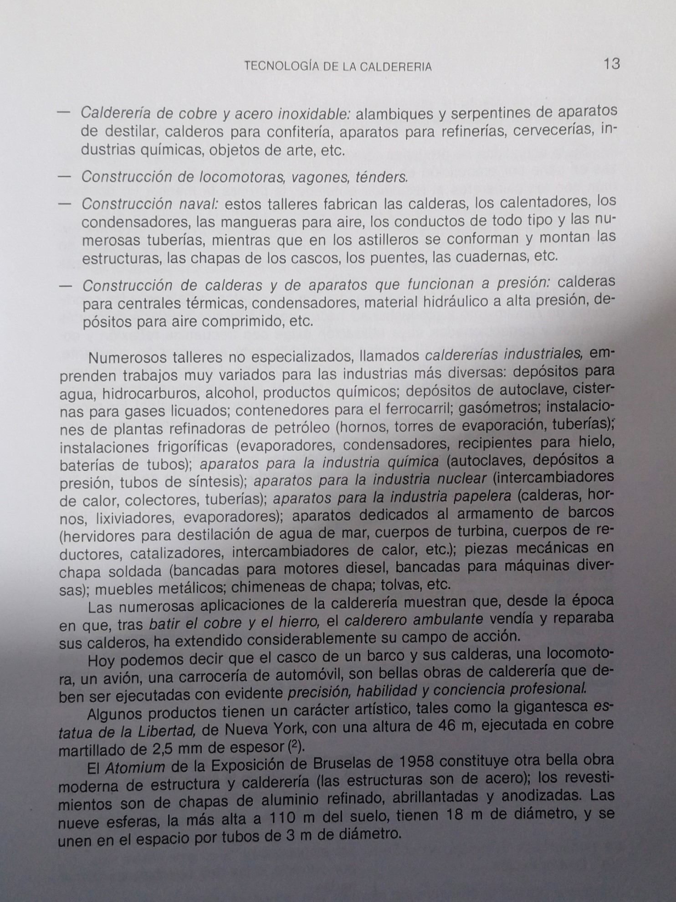

# Details of a book image without OCR
Counting characters, words and lines of a text in an image of a book page with poor lighting and shadows.
### Preprocessing:
1. Image acquisition.
2. Background removal.
3. Image binarization.
4. Filtering to remove noise and join isolated points.

### Counting:
1. Labeling of connected regions (characters).
2. Calculation of the area of each region.
3. Definition of an area threshold for counting characters.
4. Counting words and lines from the characters.

## Before & After Processing

## Skeleton BW zoomed

## Original image

